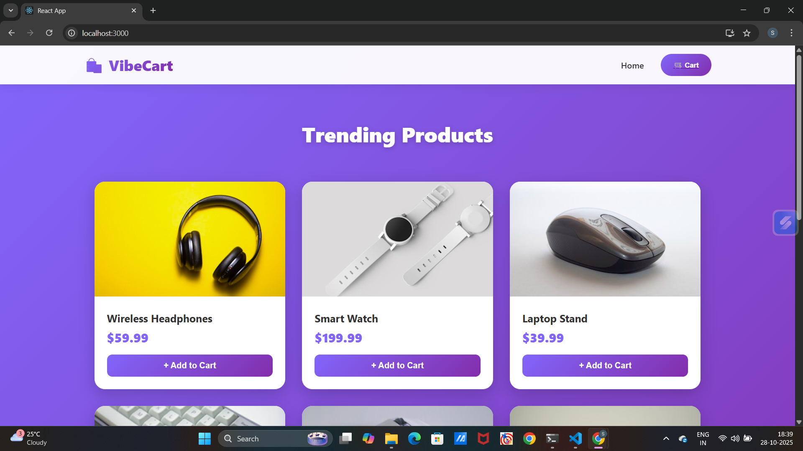
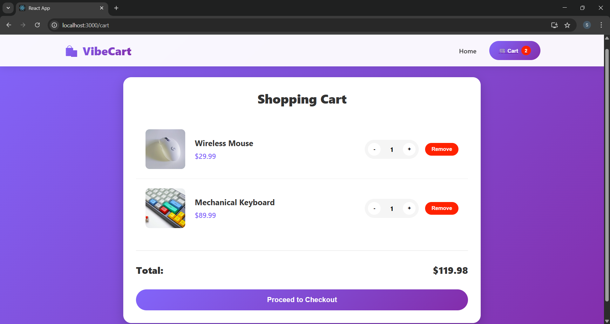
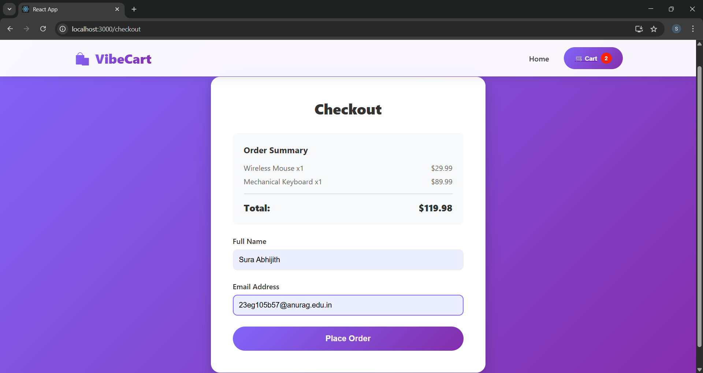
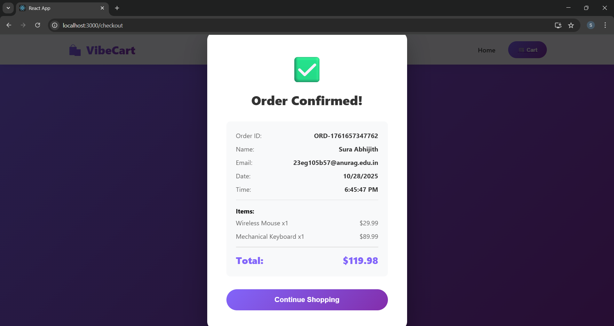

# 🛍️ VibeCart - E-Commerce Shopping Cart

A modern, full-stack e-commerce shopping cart application built with React, Node.js, Express, and REST APIs.

## ✨ Features

- 🎨 Modern, responsive UI with gradient design
- 🛒 Add/Remove items from cart
- 📊 Real-time cart updates
- 🔢 Quantity management (increase/decrease)
- 💳 Mock checkout process with form validation
- 📱 Mobile-friendly responsive design
- ✅ Order confirmation with detailed receipt
- 🎯 Clean and intuitive user experience

## 🚀 Tech Stack

**Frontend:**
- React 18
- React Router v6
- Axios for API calls
- Context API for state management
- Modern CSS with animations and gradients
- Responsive design (mobile + desktop)

**Backend:**
- Node.js
- Express.js
- RESTful API architecture
- In-memory data storage
- CORS enabled

## 📁 Project Structure

vibe-ecom-cart/
├── backend/
│ ├── server.js # Main Express server
│ ├── package.json # Backend dependencies
│ └── node_modules/
├── frontend/
│ ├── src/
│ │ ├── components/ # Reusable components
│ │ │ ├── Navbar.jsx
│ │ │ ├── ProductCard.jsx
│ │ │ ├── ProductGrid.jsx
│ │ │ ├── CartItem.jsx
│ │ │ └── Receipt.jsx
│ │ ├── context/ # State management
│ │ │ └── CartContext.jsx
│ │ ├── pages/ # Main pages
│ │ │ ├── Home.jsx
│ │ │ ├── CartPage.jsx
│ │ │ └── CheckoutPage.jsx
│ │ ├── App.js
│ │ ├── App.css
│ │ ├── index.js
│ │ └── index.css
│ ├── public/
│ ├── package.json # Frontend dependencies
│ └── .env # Environment variables
├── screenshots/ # Application screenshots
└── README.md # This file

text

## 🛠️ Installation & Setup

### Prerequisites
- Node.js (v14 or higher)
- npm or yarn
- Modern web browser

### Backend Setup

1. Navigate to backend directory:
cd backend

text

2. Install dependencies:
npm install

text

3. Start the backend server:
npm run dev

text

✅ Backend runs on `http://localhost:5000`

### Frontend Setup

1. Open a new terminal and navigate to frontend directory:
cd frontend

text

2. Install dependencies:
npm install

text

3. Start the React development server:
npm start

text

✅ Frontend runs on `http://localhost:3000`

The browser will automatically open and display the application!

## 📸 Screenshots

### Home Page - Product Listing

### Shopping Cart

### Checkout Page

### Order Receipt

## 🔌 API Endpoints

| Method | Endpoint | Description |
|--------|----------|-------------|
| GET | `/api/products` | Get all products (8 items) |
| POST | `/api/cart` | Add item to cart |
| GET | `/api/cart` | Get all cart items with total |
| PUT | `/api/cart/:id` | Update item quantity |
| DELETE | `/api/cart/:id` | Remove item from cart |
| POST | `/api/checkout` | Process checkout and generate receipt |

## 🎯 Features Implemented

### Core Requirements ✅
- ✅ GET /api/products - Returns 8 mock products
- ✅ POST /api/cart - Add items with quantity
- ✅ DELETE /api/cart/:id - Remove items
- ✅ GET /api/cart - Get cart with total
- ✅ POST /api/checkout - Mock checkout with receipt
- ✅ Products grid with "Add to Cart" buttons
- ✅ Cart view with quantity controls
- ✅ Checkout form (name/email)
- ✅ Receipt modal on order completion
- ✅ Fully responsive design

### Additional Features ✅
- ✅ Real-time cart badge counter
- ✅ Smooth animations and transitions
- ✅ Error handling
- ✅ Loading states
- ✅ Empty cart state
- ✅ Update quantity (+ / - buttons)
- ✅ Modern gradient UI
- ✅ Mobile-responsive layout
- ✅ Order ID generation
- ✅ Timestamp on receipts

## 💡 How to Use

1. **Browse Products:** View all available products on the home page
2. **Add to Cart:** Click "Add to Cart" on any product
3. **View Cart:** Click the cart icon to see your items
4. **Update Quantities:** Use + and - buttons to adjust quantities
5. **Remove Items:** Click "Remove" to delete items from cart
6. **Checkout:** Click "Proceed to Checkout" and fill in your details
7. **Confirm Order:** Submit the form to see your order receipt
8. **Continue Shopping:** Click to return to the home page

## 🎨 Design Highlights

- **Modern Gradient Background:** Purple to blue gradient
- **Card-based UI:** Elevated cards with shadows and hover effects
- **Smooth Animations:** Transitions on buttons, cards, and modals
- **Responsive Grid:** Auto-adjusting product grid
- **Clean Typography:** Clear hierarchy and readable text
- **Color Scheme:** Professional purple/blue theme
- **User Feedback:** Button states, loading indicators, success messages

## 🚧 Future Enhancements

- MongoDB integration for data persistence
- User authentication and login
- Product search and filtering
- Wishlist functionality
- Order history
- Payment gateway integration (Stripe)
- Admin dashboard
- Product reviews and ratings
- Email notifications
- Multiple product categories

## 📝 Assignment Requirements Met

✅ Backend APIs (All 5 endpoints implemented)  
✅ Frontend React components (All UI elements)  
✅ Shopping cart functionality  
✅ Checkout flow  
✅ Mock receipt generation  
✅ Responsive design  
✅ Clean folder structure  
✅ Professional README  
✅ Screenshots included  
✅ Modern styling and UX  

## 👨‍💻 Developer

Built as an internship assignment for **Nexora**

**Timeline:** Completed within 48 hours  
**Date:** October 28-30, 2025

## 📧 Contact

For questions or feedback, please reach out through GitHub.

---

**Built with ❤️ using React, Node.js, and Express**
